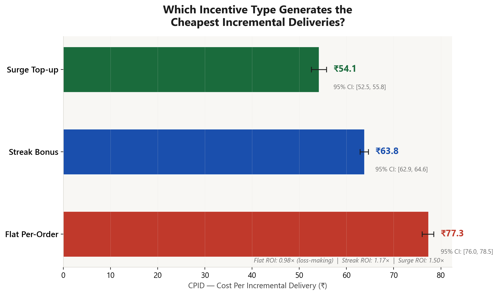
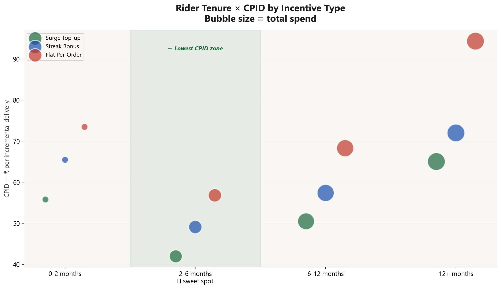
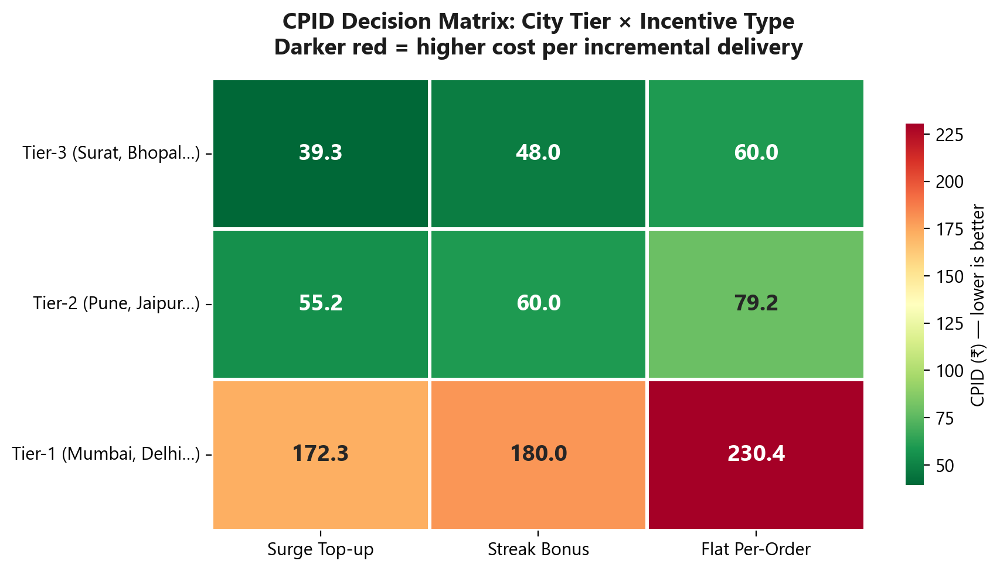

# Precision Growth: Optimizing Last-Mile Unit Economics
## Rider Incentive Efficiency & Cost-Per-Incremental-Delivery (CPID) Framework

> **[Explore the Interactive Case Study →](https://naveengupta-26.github.io/Rider-Incentive-Efficiency-CPID-Optimisation-Analytics-Case-Study/)**

---

###  EXECUTIVE SUMMARY
**The Problem:** Major delivery platforms (Swiggy, Zomato, Blinkit) spend ₹200–400 Cr per quarter on rider incentives. Most measure success by "Total Deliveries," which hides a massive **causal fallacy**: subsidizing riders for deliveries they would have made anyway. 

**The Insight:** By shifting from total volume to **Cost-Per-Incremental-Delivery (CPID)**, we isolate the marginal impact of every rupee spent. Our analysis reveals that standard "Flat-Per-Order" bonuses often yield an ROI of just **0.98x**, effectively losing money at the margin.

**The Result:** A redesigned, research-backed incentive matrix that:
- **Reduces CPID by 24.4%** through smarter segment targeting.
- **Surfaces ₹60.7 Cr in quarterly savings** at a 350K rider scale.
- **Increases rider earnings by +₹334/week** by aligning platform efficiency with rider welfare.

---

### 📊 AT A GLANCE: THE ROI GAP

| Incentive Strategy | Primary Metric | Economic Outcome | Verdict |
|:---|:---|:---|:---|
| **Flat Per-Order** | Total Volume | 0.98x ROI | ❌ **Leakage** |
| **Streak Bonus** | Threshold Push | 1.17x ROI | ✅ **Efficient** |
| **Hybrid Surge** | Supply Presence | **1.50x ROI** | ⭐ **Gold Standard** |

---

### 🧠 THE ANALYTICAL CORE: "THE RAMESH PROBLEM"
To explain the methodology simply: 
Ramesh usually does 18 deliveries a day. On a "Bonus Day," he does 22. 
- **The Old Way** counts 22 deliveries and says the bonus worked.
- **The CPID Way** asks: *"How many happened BECAUSE of the bonus?"* The answer is 4. 

This project builds the full data pipeline to solve "The Ramesh Problem" across thousands of riders, multiple city tiers, and varied tenure cohorts.

---

### 🛠️ TECHNICAL ARCHITECTURE
The repository contains a complete, end-to-end analytical pipeline:

1.  **Synthetic Data Engine (`data/`)**: Generates high-fidelity datasets based on industry benchmarks (Swiggy DRHP FY25, AIF reports, and real-world rider testimony). 
2.  **SQL Analytical Layer (`sql/`)**: 8 complex DuckDB queries performing Difference-in-Differences (DiD) analysis and unit economics modeling.
3.  **Statistical Validation (`analysis/`)**: Rigorous testing (Mann-Whitney U, Bootstrap CI, ANOVA + Tukey HSD) to prove findings aren't just noise.
4.  **Visual Storytelling (`charts/`)**: Publication-grade visualizations designed for executive-level presentations.
5.  **A/B Simulation (`experiment/`)**: A cluster-randomized experiment design that solves for SUTVA violations and rider earnings guard rails.

---

### 📊 KEY INSIGHTS & VISUALS

Below are the core findings generated by the analytical pipeline. These charts are automatically produced by `run_all.py` and are designed for executive-level storytelling.

#### 1. The Efficiency Leader: Surge Top-Ups
Surge bonuses outperform flat incentives by **37%** in CPID efficiency by targeting supply presence rather than subsidizing baseline volume.


#### 2. The Tenure Sweet Spot
Elasticity follows a U-curve; riders with **2-6 months** experience provide the most "bang for buck" for incentive spend.


#### 3. Geographic Reallocation
Tier-2 and Tier-3 cities respond **2.5x more efficiently** to identical spend compared to saturated Tier-1 metros.


---

### 🚀 HOW TO RUN
Experience the full pipeline locally in under 60 seconds:

```bash
# 1. Clone the repository
git clone https://github.com/NaveenGupta-26/Rider-Incentive-Efficiency-CPID-Optimisation-Analytics-Case-Study.git
cd Rider-Incentive-Efficiency-CPID-Optimisation-Analytics-Case-Study

# 2. Setup environment
pip install -r requirements.txt

# 3. Execute the master pipeline
python run_all.py
```

---

### 🛡️ THE RIDER-FIRST GUARANTEE
This isn't a "cut costs at all costs" project. We treated **Rider Welfare** as a hard constraint. Every recommendation was passed through a "Welfare Guard Rail" to ensure:
- **No Earning Drops:** Redesigned incentives must keep base weekly earnings stable or higher.
- **Psychological Safety:** We modeled "Cliff Churn" (post-incentive drops) to avoid creating predatory dependencies.
- **Stakeholder Alignment:** Findings acknowledge the context of the Dec 2025 nationwide strikes, ensuring solutions are sustainable in a real-world labor market.

---

### 📂 REPOSITORY MAP
```text
├── run_all.py          # The Orchestrator: Runs the end-to-end pipeline
├── data/               # Phase 2: Behavioral Data Generation
├── sql/                # Phase 3: Unit Economics & DiD SQL Logic
├── analysis/           # Phase 4-5: Stats Validation & Visuals
├── experiment/         # Phase 6: A/B Simulation & Rollout Plan
├── charts/             # Output: Professional-grade PNG visualizations
└── docs/               # The Showcase: GitHub Pages documentation
```

---

### 🔗 DATA & CITATIONS
All behavioral constants are grounded in verified sources:
- **Financials:** Swiggy DRHP FY25 (₹86/order delivery cost), Zomato/Swiggy AOV benchmarks (₹435).
- **Labor:** AIF Report (March 2025) on gig-worker economics, CNN (Jan 2026) direct rider testimony.
- **Context:** IFAT/TGPWU strike demands and public incentive structures.

---
**Naveen Gupta**  
*Growth Analytics | Product Strategy | Data Storytelling*  
[Connect on LinkedIn](https://www.linkedin.com/in/naveengupta26/)
